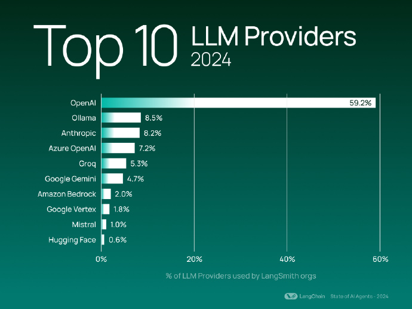

## AI行业

### 2024AI年度事件
（作者：蚁工厂 原文：https://weibo.com/2194035935/P7pqVAmPd）

### LLM供应商TOP10

（作者：蚁工厂 原文：https://weibo.com/2194035935/P5Hbf6zA1 ）

## DeepSeek V3相关

### DeepSeek V3 GGUF 的2位量化版本
最低能跑起来的配置是 48GB RAM + 250GB 磁盘空间。
据说性能下降不大，可用。
上下文似乎是16k。  
（作者：蚁工厂 原文：https://weibo.com/2194035935/P8AJY0daU）

### 架构图
  
（作者：蚁工厂 原文：https://weibo.com/2194035935/P7FFhCkw5）

### 评测排名
deepseek v3在lmarena（之前的lmsys）排行榜的众包评测排名
总分第7，在复杂问题、编码和数学问题上的得分还要更高，是个更偏理科一些模型。同时也是排名前10中唯一的开源模型。  
（作者：蚁工厂 原文：https://weibo.com/2194035935/P7hY88X1S）

### 训练时长
DeepSeek-V3 的训练只用了2.788M H800 GPU hours。也就是两千台H800 （H100的中国定制低配版）训练两个月。

## 开源
2024.12.26
huggingface.co/deepseek-ai/DeepSeek-V3-Base
参数量：685B，MoE架构。官方还没公开进一步的信息就先上线和开源了（和Mixtral 学的吗[笑cry]）
从目前得到的消息不管是跑分还是体验都很出色。不在Sonnet 之下。开源之光。 ​​​ 
（作者：蚁工厂 原文：https://weibo.com/2194035935/P6BHnld4p）

## qwen2.5相关
### qwen2.5的=技术报告
#### 地址
https://arxiv.org/pdf/2412.15115

## oi模型相关

### 讨论如何复现OpenAI的o1模型的论文
#### 论文标题
Scaling of Search and Learning: A Roadmap to Reproduce o1 from Reinforcement Learning Perspective>  
#### 地址
arxiv.org/pdf/2412.14135
#### 简介
论文由复旦大学和上海人工智能实验室的研究人员撰写。  
o1模型在多个复杂任务上展现出专家级表现，主要依赖于强化学习技术。  
文章聚焦于四个关键组成部分：策略初始化、奖励设计、搜索和学习，这些是构建具有强大推理能力的大语言模型（LLM）的关键。  
通过深入分析这些组成部分，文章为LLM的发展提供了有意义的贡献，并探讨了如何通过学习和搜索推动o1的进步。  
（作者：蚁工厂 原文：https://weibo.com/2194035935/P7dLmkea4）
#### 目录

### 分析o3的长文
#### 地址
https://www.interconnects.ai/p/openais-o3-the-2024-finale-of-ai?continueFlag=4eb33b14b5288121f74719c13c0c4a02
#### 简介
Nathan Lambert写的一篇分析OpenAI刚发布的o3的长文。
（作者：蚁工厂 原文：https://weibo.com/2194035935/P5RGY7Yoi）

