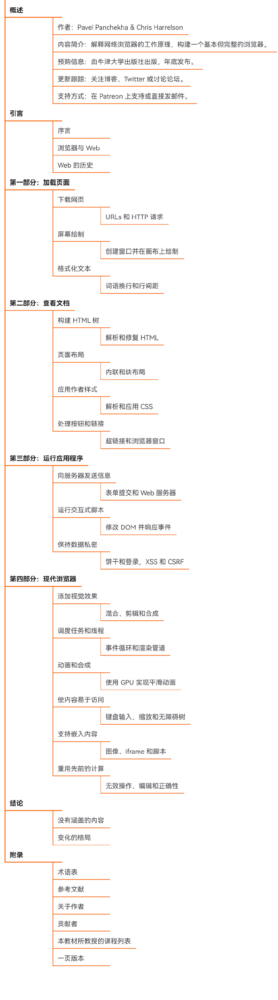

## 其他有意思的

### 在PDF中编程实现一个计算器
#### 地址
https://www.nutrient.io/blog/how-to-program-a-calculator-pdf/?continueFlag=4eb33b14b5288121f74719c13c0c4a02

### 在PDF中编程实现俄罗斯方块
#### 地址
代码：github.com/ThomasRinsma/pdftris
演示：th0mas.nl/downloads/pdftris.pdf

### Web Browser Engineering
#### 地址
browser.engineering/
#### 简介
一本教你做一个浏览器的书
书籍会为你解释网络浏览器的工作机制，教你使用几千行 Python 代码通过构建一个基础但完整的浏览器来详细了解从网络请求到 JavaScript 执行的全过程。  
书中分为四个部分：加载页面、查看文档、运行应用程序和现代浏览器的特性。  
每个部分都详细介绍了浏览器的关键功能，如下载网页、屏幕绘制、HTML 和 CSS 解析、页面布局、表单提交、DOM 操作、安全性（如 Cookie 和 XSS）、视觉效果、任务调度、动画合成、无障碍访问和嵌入内容处理等。
（作者：蚁工厂 原文：https://weibo.com/2194035935/P7ZsTAOjc）
#### 目录
