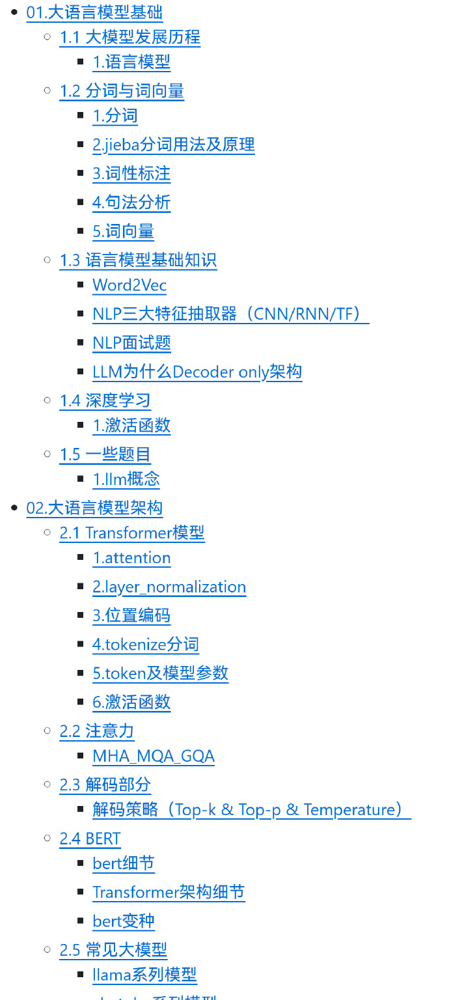
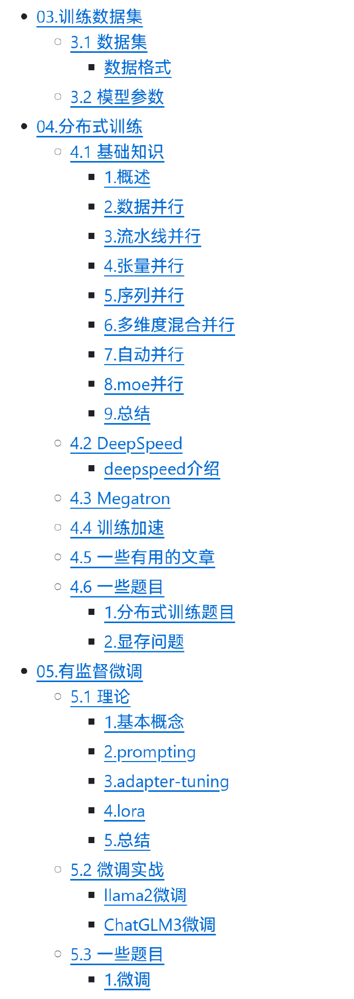
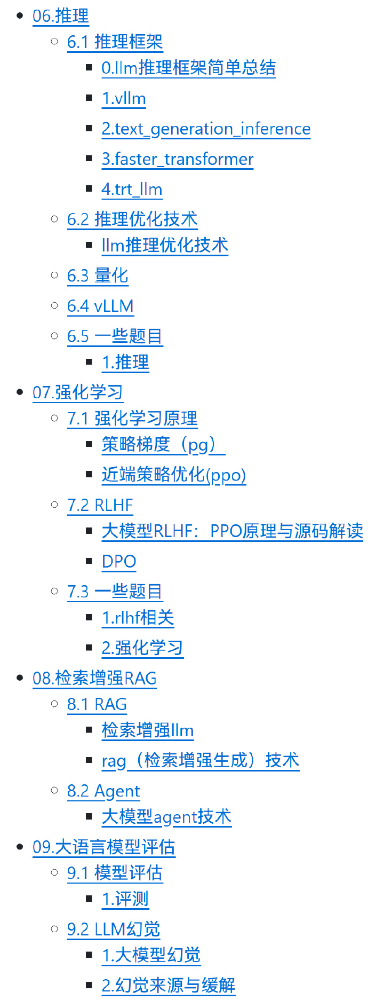
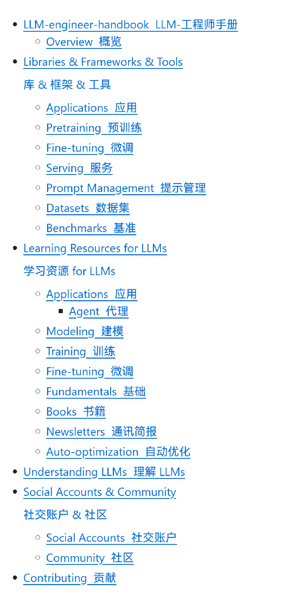
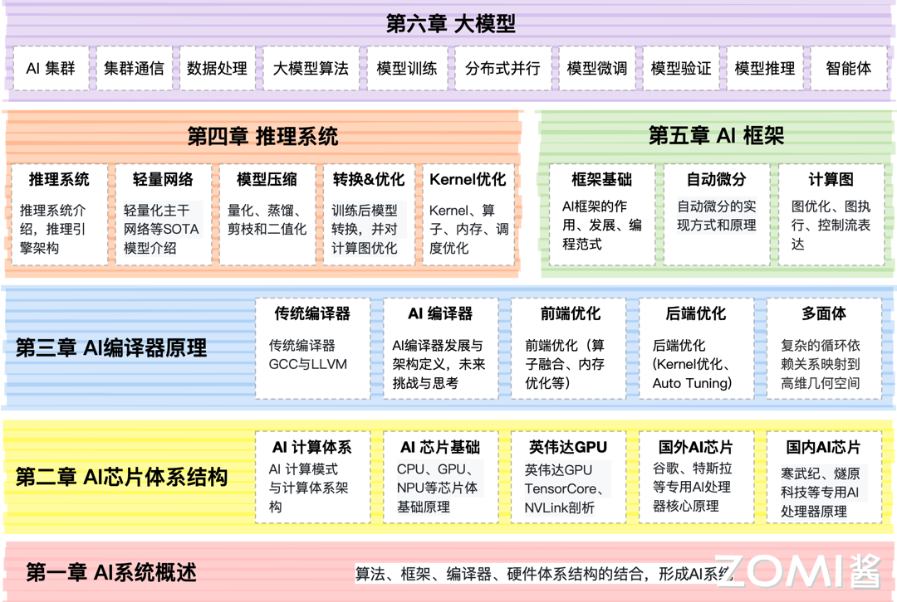
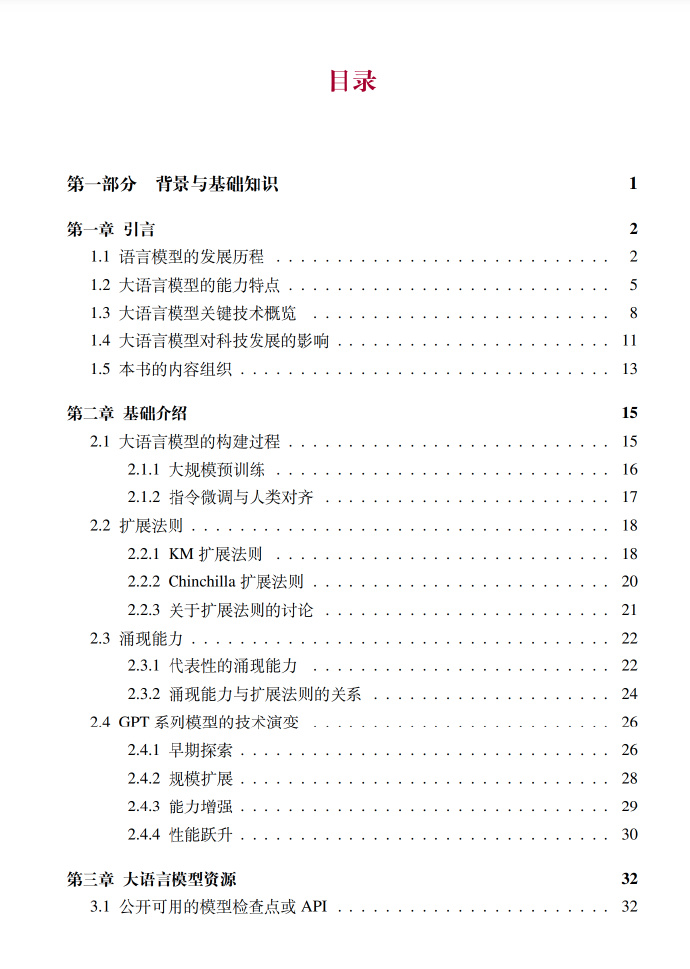
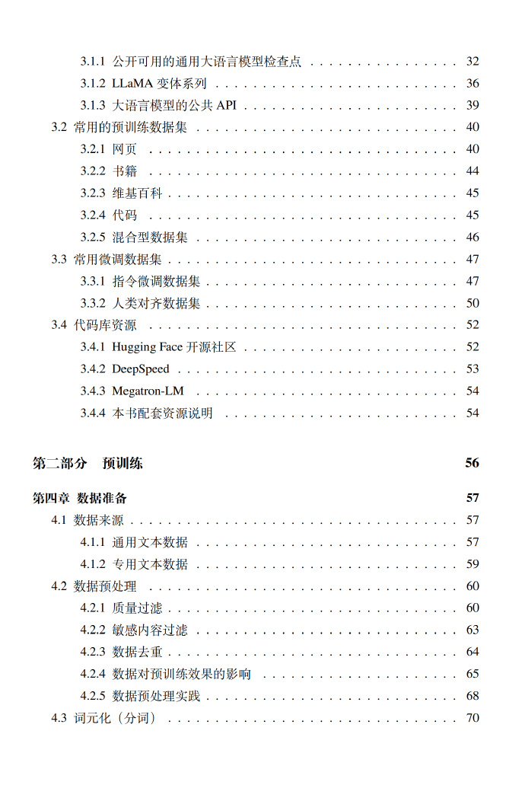
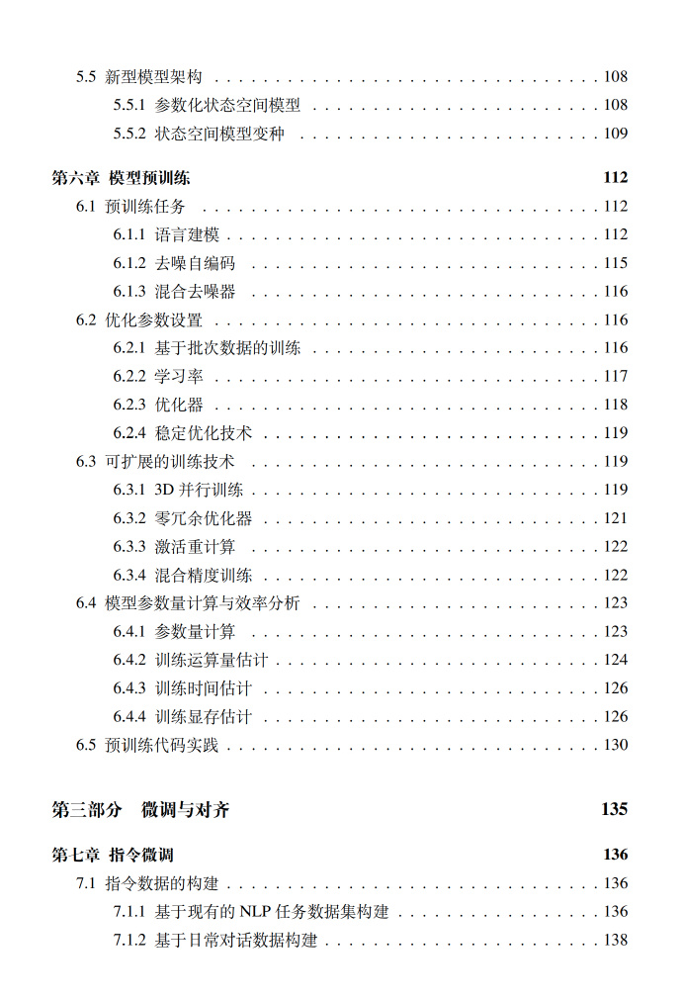
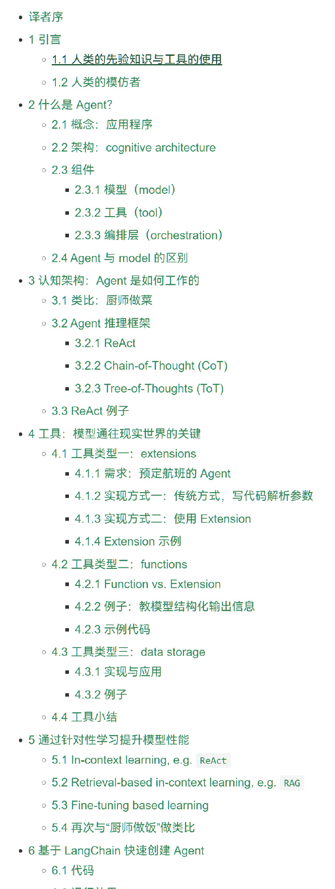

# 资源汇总

## llm_interview_note
#### 地址
github.com/wdndev/llm_interview_note
#### 简介
Github上一个收集大语言模型算法（应用）工程师相关的知识及面试题的仓库
（作者：蚁工厂 原文：https://weibo.com/2194035935/P8EK2rdH5）
#### 目录

## DecryptPrompt
#### 地址
https://github.com/DSXiangLi/DecryptPrompt  
#### 简介
总结Prompt&LLM论文，开源数据&模型，AIGC应用
#### 内容
LLM资源汇总  
跟着博客读论文  
论文汇总

## LLM-engineer-handbook
#### 地址
https://github.com/SylphAI-Inc/LLM-engineer-handbook
#### 简介
这个Github项目为大型语言模型的工程师提供全面的指导和支持。它包括了模型训练的最佳实践、部署方法、微调技巧以及构建基于 LLM 的应用程序的策略。这份手册不仅汇集了各种实用的资源，如文档、教程和工具，而且还提供了关于如何有效利用这些资源来提升 LLM 项目的成功率的见解。
（作者：蚁工厂 原文：https://weibo.com/2194035935/P95qThQaI）
#### 目录

 
# 课程

## A Smol Course
#### 地址
github.com/huggingface/smol-course
#### 简介
huggingface官方的一个 对齐 (align) 小型语言模型的课程
教你如何调教小模型，涵盖了从初始训练到生产部署的各个环节，让学员掌握微调小型语言模型的实用技能。具体包括以下几个模块：
⭐指令微调 (Instruction Tuning): 学习监督式微调、聊天模板和基本的指令跟随。
⭐偏好对齐 (Preference Alignment): 探索 DPO 和 ORPO 技术，使模型与人类偏好对齐。
⭐参数高效微调 (Parameter-efficient Fine-tuning): 学习 LoRA、提示调整和其他高效的适配方法。
⭐评估 (Evaluation): 使用自动基准测试并创建自定义领域评估。
⭐视觉-语言模型 (Vision-language Models): 调整多模态模型以适应视觉-语言任务。
⭐合成数据集 (Synthetic Datasets): 创建和验证用于训练的合成数据集。
⭐推理 (Inference): 高效地进行模型推理。
⭐顶点项目 (Capstone Project): 刷榜~~
（作者：蚁工厂 原文：https://weibo.com/2194035935/P8Ljz3vnE）

## AI系统 
#### 地址
课程网站：https://chenzomi12.github.io/  
课程视频：https://space.bilibili.com/517221395  
课程PPT: https://github.com/chenzomi12/AISystem  
#### 简介
（作者：蚁工厂 原文：https://weibo.com/2194035935/P8XZTFMU4）
#### 目录
（注：第六章还没有写_2025.1.10）  

 
# 书籍

## 大模型理论基础
#### 地址
datawhalechina.github.io/so-large-lm/
#### 简介
作者:主要作者为哈工大博士生陈安东
内容：本书内容以斯坦福大学大规模语言模型课程为基础，结合来自开源贡献者的补充和完善，以及对前沿大模型知识的及时更新，为读者提供较为全面而深入的理论知识和实践方法。
（作者：蚁工厂 原文：https://weibo.com/2194035935/P97jocQxU）
#### 目录

## 大语言模型
#### 地址
https://github.com/LLMBook-zh/LLMBook-zh.github.io
#### 简介 
作者：中国人民大学AI Box、中国人民大学高瓴人工智能学院教授赵鑫等编著  
内容：本书注重为大模型技术的入门读者提供讲解，力图展现一个整体的大模型技术框架和路线图。  
适用于具有深度学习基础的高年级本科生以及低年级研究生作为入门书籍使用。  
（作者：蚁工厂 原文：https://weibo.com/2194035935/P8BE36MTb）  
#### 目录
 
 

## 大模型基础
#### 地址
https://github.com/ZJU-LLMs/Foundations-of-LLMs
#### 简介
作者：浙江大学毛玉仁、高云君等
内容：这本书和一般的著作不太一样，因为大模型的技术这几年发展太快了，本书的一个目标也是“月度更新”，自半年前发布后就在不断update，致力打造易读、严谨、有深度的大模型教材。  
另外本书的Github仓库还收集了一份大模型经典论文列表、一份持续更新的大模型方向的Arxiv一周进展报告。  
特点是跟进新技术。
（作者：蚁工厂 原文：https://weibo.com/2194035935/P8uJP97xe）
#### 目录

## 大规模语言模型：从理论到实践
#### 地址
https://intro-llm.github.io/
#### 简介
作者：张奇
内容：本书围绕大语言模型构建的四个主要阶段：预训练、有监督微调、奖励建模和强化学习，详细介绍各阶段使用的算法、数据、难点以及实践经验。  
比较偏理论。
（作者：蚁工厂 原文：https://weibo.com/2194035935/P97jocQxU）

## 生成式AI与大模型
#### 地址
siliconflow.feishu.cn/file/OSZtbnfYQoa4nBxuQ7Kcwpjwnpf
#### 简介
作者：微博账号OneFlow 整理制作
内容：分为八大板块：概览、大模型基本原理、大模型训练没有秘密、大模型“第二增长曲线”：推理、AI芯片变局、生成式AI产品构建、生成式AI产业分析、AGI的挑战与未来。
（作者：蚁工厂 原文：https://weibo.com/2194035935/P7Z8DsFFl）
#### 目录

 
# 教学类项目

## 动手学大模型应用开发
#### 地址
datawhalechina.github.io/llm-universe/
#### 简介
本项目是一个面向小白开发者的大模型应用开发教程，旨在基于阿里云服务器，结合个人知识库助手项目，通过一个课程完成大模型开发的重点入门，主要内容包括：
⭐大模型简介，何为大模型、大模型特点是什么、LangChain 是什么，如何开发一个 LLM 应用，针对小白开发者的简单介绍；
⭐如何调用大模型 API，本节介绍了国内外知名大模型产品 API 的多种调用方式，包括调用原生 API、封装为 LangChain LLM、封装为 Fastapi 等调用方式，同时将包括百度文心、讯飞星火、智谱AI等多种大模型 API 进行了统一形式封装；
⭐知识库搭建，不同类型知识库文档的加载、处理，向量数据库的搭建；
⭐构建 RAG 应用，包括将 LLM 接入到 LangChain 构建检索问答链，使用 Streamlit 进行应用部署
⭐验证迭代，大模型开发如何实现验证迭代，一般的评估方法有什么
（作者：蚁工厂 原文：https://weibo.com/2194035935/P968k74td）

## MiniMind"大道至简"
#### 地址
github.com/jingyaogong/minimind
#### 简介
微型语言模型项目：
本项目的目标是把上手LLM的门槛无限降低， 直接从0开始训练一个极其轻量的语言模型。  
最快仅用3小时,即可训练出仅为26.88M大小的微型语言模型MiniMind。  
MiniMind发布了大模型极简结构，数据集清洗和预处理、监督预训练(Pretrain)、有监督指令微调(SFT)、低秩自适应(LoRA) 微调，无奖励强化学习直接偏好对齐(DPO)的全阶段代码，也包含拓展共享混合专家(MoE) 的稀疏模型；拓展视觉多模态VLM: MiniMind-V。  
这不仅是一个开源模型的实现，也是入门大语言模型（LLM）的教程。
（作者：蚁工厂 原文：https://weibo.com/2194035935/P8mrCtBL9）

## 开源大模型食用指南
#### 地址
github.com/datawhalechina/self-llm
#### 简介
这个datawhale的教学项目现在已经超过1万star了。本项目是一个围绕开源大模型、针对国内初学者、基于 Linux 平台的中国宝宝专属大模型教程，针对各类开源大模型提供包括环境配置、本地部署、高效微调等技能在内的全流程指导，简化开源大模型的部署、使用和应用流程，让更多的普通学生、研究者更好地使用开源大模型，帮助开源、自由的大模型更快融入到普通学习者的生活中。

本项目的主要内容包括：
⭐基于 Linux 平台的开源 LLM 环境配置指南，针对不同模型要求提供不同的详细环境配置步骤；
⭐针对国内外主流开源 LLM 的部署使用教程，包括 LLaMA、ChatGLM、InternLM 等；
⭐开源 LLM 的部署应用指导，包括命令行调用、在线 Demo 部署、LangChain 框架集成等；
⭐开源 LLM 的全量微调、高效微调方法，包括分布式全量微调、LoRA、ptuning 等。

（作者：蚁工厂 原文：https://weibo.com/2194035935/P8sdygQOb）

 
# 博客

## 谷歌AI Agent 技术白皮书
#### 地址
arthurchiao.art/blog/ai-agent-white-paper-zh/
#### 简介
谷歌 AI Agent（智能体）技术白皮书翻译稿
（作者：蚁工厂 原文：https://weibo.com/2194035935/P8BMaaaIk）
#### 目录

## AI Agent
#### 地址
https://huyenchip.com//2025/01/07/agents.html?continueFlag=4eb33b14b5288121f74719c13c0c4a02
#### 简介
作者:Chip Huyen，斯坦福毕业的越南妹子  
内容：一篇关于AI Agent的详细笔记  
本文主要介绍了AI代理（Agent）的概念、工具使用、规划能力以及评估方法。  
（作者：蚁工厂 原文：https://weibo.com/2194035935/P8DWwc2Uq）

