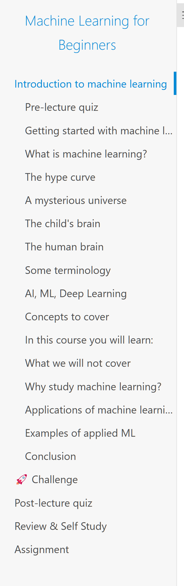

# 课程

### ML-For-Beginners
#### 地址
microsoft.github.io/ML-For-Beginners/
#### 简介
微软官方提供的机器学习入门课程
这是一个为期12周、包含26课的课程，主要教授经典机器学习知识，使用Scikit-learn库，避开深度学习内容。
（作者：蚁工厂 原文：https://weibo.com/2194035935/P8Ti6e8LA）
#### 目录

### 加州大学伯克利分校的简明机器学习讲义
#### 地址
people.eecs.berkeley.edu/~jrs/papers/machlearn.pdf
#### 简介
作者：Jonathan Richard Shewchuk，加州大学伯克利分校的计算机科学教授。  
内容：这份讲义能为已经熟悉向量微积分、线性代数、概率论和统计学的读者提供一个快速入门机器学习的介绍。  
这份笔记可能非常适合那些希望尽快学习机器学习基础知识、具有一定数学基础的读者。
（作者：蚁工厂 原文：https://weibo.com/2194035935/P8afF4PJJ）

 
# 书籍

## 理论

## 《最优化：建模、算法与理论》《最优化计算方法》
#### 地址
faculty.bicmr.pku.edu.cn/~wenzw/optbook.html
#### 简介
作者：文再文
内容：两本书都是讲最优化计算方法。《最优化：建模、算法与理论》更详细些，《最优化计算方法》是简化版。  

最优化计算方法是运筹学、计算数学、机器学习和数据科学与大数据技术等专业的一门核心课程。  
最优化问题通常需要对实际需求进行定性和定量分析，建立恰当的数学模型来描述该问题，设计合适的计算方法来寻找问题的最优解，探索研究模型和算法的理论性质，考察算法的计算性能等多方面。  
最优化广泛应用于科学与工程计算、数据科学、机器学习、人工智能、图像和信号处理、金融和经济、管理科学等众多领域。  
本书将介绍最优化的基本概念、典型案例、基本算法和理论。  
通过本书的学习，掌握最优化的基本概念，最优性理论，典型的几类最优化问题（如凸优化，无约束优化，约束优化，复合优化等等）的建模或判别，相关优化问题的基本计算方法，并能熟练调用基于MATLAB或Python等语言的典型优化软件程序求解一些标准的优化问题，灵活运用所讲授的算法和理论求解一些非标准的优化问题。  
达到锻炼将实际问题建立合适最优化模型的能力，选择合适的现有软件包和算法的能力，遇到没有现成算法自己实现简单算法的能力。  
（作者：蚁工厂 原文：https://weibo.com/2194035935/P7ZksdyP8）

