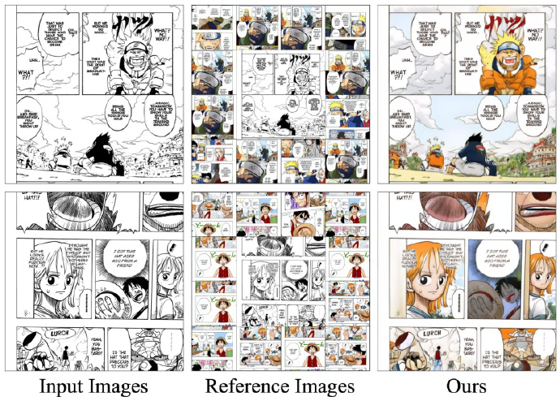

### ColorFlow
#### 地址
zhuang2002.github.io/ColorFlow/ ​​​
#### 简介
清华和腾讯开源的检索增强图像序列着色项目ColorFlow，可以用于漫画着色

（作者：蚁工厂 原文：https://weibo.com/2194035935/P5Tuy3QMO ）

### Pandas AI
#### 地址
github.com/Sinaptik-AI/pandas-ai
#### 简介
使您能够用自然语言向数据提问。  
帮助非技术用户以更自然的方式与数据互动，并帮助技术用户在处理数据时节省时间和精力。
（作者：蚁工厂 原文：https://weibo.com/2194035935/P5xGQ6g31 ）
